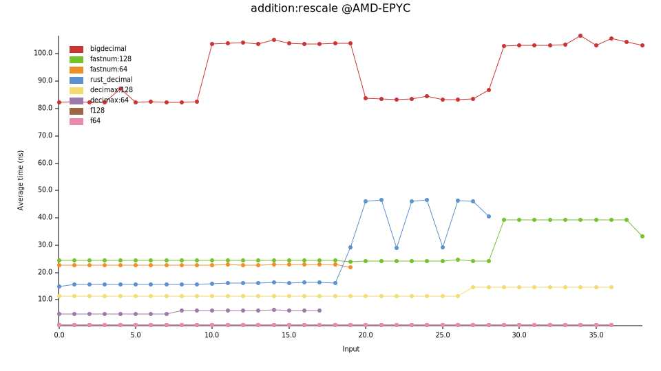
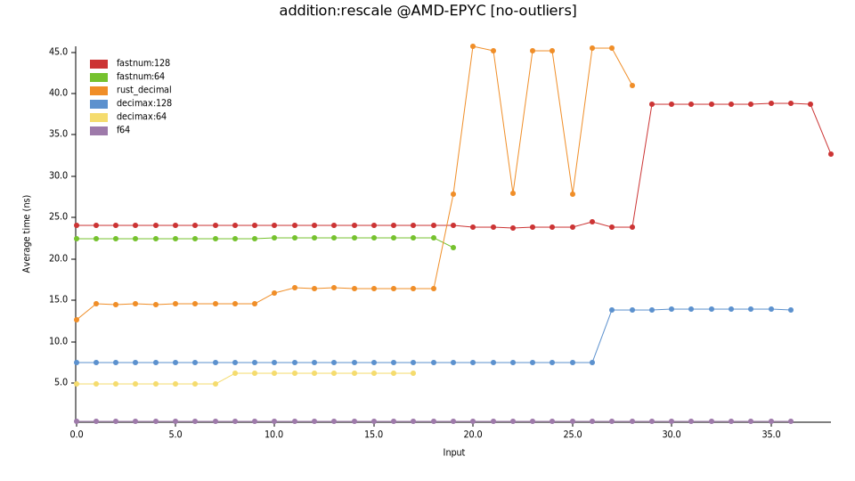
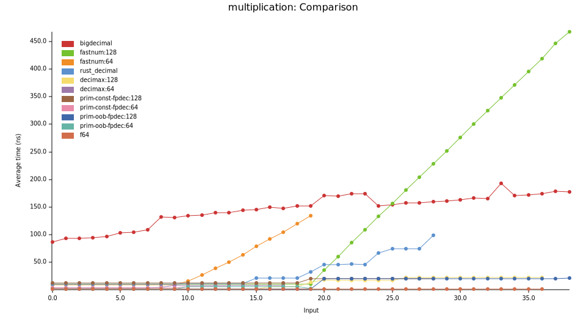
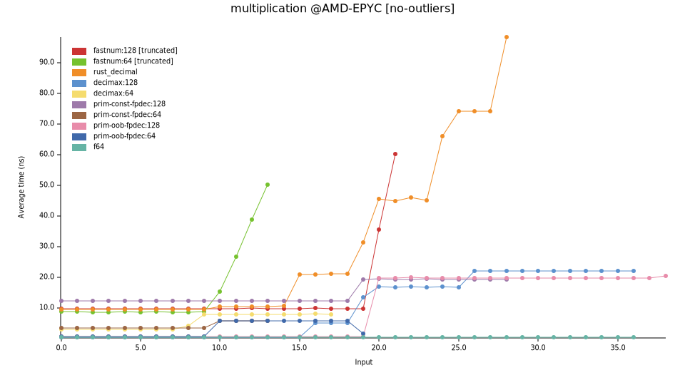
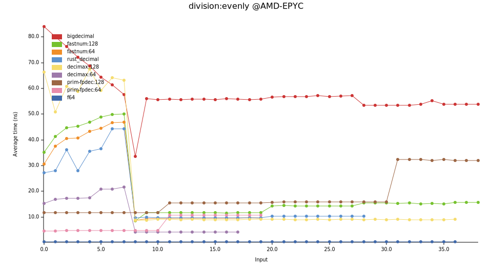
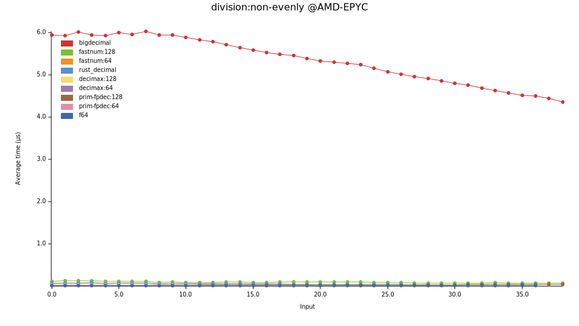
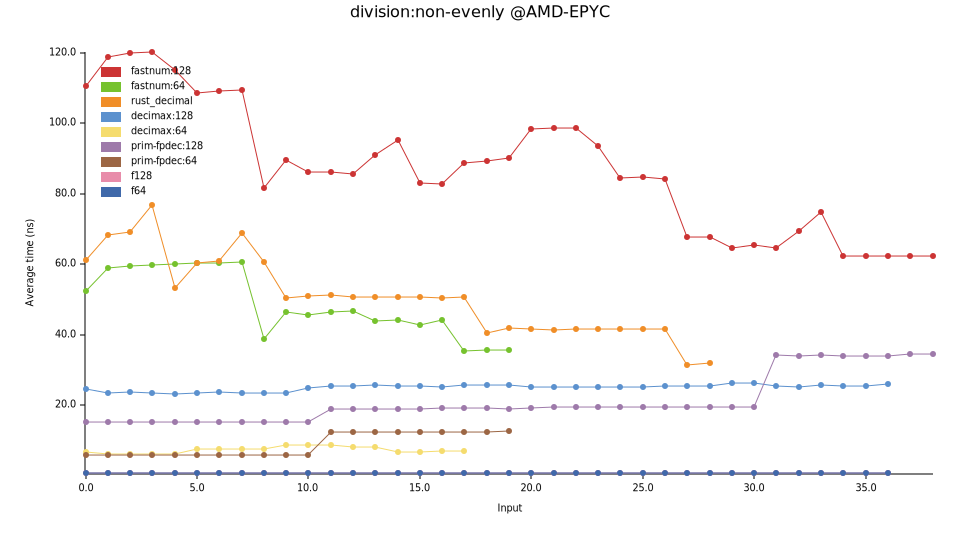

# Rust Decimal Crates 对比和压测

## 简介

众所周知，由于2和10的质因子不相同，二进制小数无法准确表示十进制小数。比如 `f32` 有经典的算术误差：0.1+0.2!=0.3。

有的应用场景，比如金融，需要精确表示十进制小数。这就需要十进制库 decimal crate。其基本原理是，使用整数来表示有效数字mantissa，再用一个scale来表示十进制的小数位数。比如，值1.23，可以用整数123和scale=2来表示。

Rust生态中有很多decimal crate，设计不同，各有侧重。他们的区别主要在于两点：

1. scale是固定的还是变化的。对应 [定点Fixed-point](https://en.wikipedia.org/wiki/Fixed-point_arithmetic) 和 [浮点Floating-point](https://en.wikipedia.org/wiki/Floating-point_arithmetic)。

2. 整数是固定数量还是任意数量。对应 [固定精度Fixed-precision](https://en.wikipedia.org/wiki/Fixed-precision_arithmetic) 和 [任意精度Arbitrary-precision](https://en.wikipedia.org/wiki/Arbitrary-precision_arithmetic)。

本文选取几种类型的crate做对比和测试。

本文目录：

- 前面两节（定点和浮点，固定精度和任意精度）介绍类型特点。并没有什么新东西，熟悉的读者可以跳过。
- 后面一节（crate的选择）选择并介绍几个decimal crate。
- 最后一节（压测对比）是本文的重点，压测并对比这几个decimal crate。

## 定点和浮点

*[Fixed-point](https://en.wikipedia.org/wiki/Fixed-point_arithmetic)* vs *[Floating-point](https://en.wikipedia.org/wiki/Floating-point_arithmetic)*。

定点的scale是固定的，不会变化的，跟数据类型type绑定的。而浮点的scale是浮动的，会随着计算而变化的，是存储在每个实例中的。

用代码说话，一个典型的 *定点数* 的定义可能是这样的：

```rust
struct FixedPoint<const SCALE: i32>(i128); // scale is bound to type
```

而一个典型的 *浮点数* 的定义可能是这样的：

```rust
struct FloatingPoint {
    mantissa: i128,
    scale: i32, // scale is stored in each instance
}
```

这就可以清楚的看到，定点数的小数精度是固定的，而浮点数的小数精度不固定。比如上述 `FixedPoint<2>` 的小数精度就是2。而 `FloatingPoint` 的小数精度，取决于每个实例的scale。由于这个区别，定点数和浮点数所表现出来的差异如下：

1. 定点数表示的范围较小，而浮点数表示的范围较大。这是由于当数值很大时，小数精度会变低。

2. 定点数更简单更快，而浮点数复杂且慢。比如加法运算，定点数只需要把表示mantissa的整数相加，而浮点数需要先判断两个操作数的scale是否一致（这个判断本身就比加法还要慢），如果不一致还需要通过乘法做对齐。下面的压测章节里会做详细介绍。

3. 定点数的使用稍微繁琐，而浮点数更方便。比如上面的 `FixedPoint`，需要在编译时就确定每个类型的scale，比如 `Balance` 几位小数，`Price` 几位小数。而浮点数则无需考虑。

两者的区别，类似静态类型语言和动态类型语言的区别。

大部分的应用使用decimal crate只是为了能精确表示十进制小数，而对性能或小数精度并没有很高的要求。那为了使用方便，优先选择浮点数。但如果是更严肃的服务，比如很多金融应用，要求确定的小数精度，或者高性能，那么建议选择定点数。比如USD资产的小数精度是2，不能多也不能少。

NOTE：由于编程语言自带的小数类型（比如C的`float`和`double`，Rust的 `f32`和`f64`）一般被称为“浮点数”，而这些类型又无法准确表示十进制小数，所以很多人以为“浮点数”就是这些类型，“浮点数”无法精确表示十进制小数。这个观点是错误的。准确的说，这些类型是“二进制”浮点数，Binary Floating-point。他们不能精确表示十进制小数的原因是“二进制 Binary”而非“浮点 Floating-point”。只不过因为他们常被叫成"浮点数 Floating-point”而省略了“二进制 Binary”，所以“floating-point”就背了这个锅。其实，即便是“二进制定点数” Binary Fixed-point，比如 [`fixed`](https://docs.rs/fixed/latest/fixed/) crate，也是不能精确表示十进制小数的。而只要是十进制decimal crate，无论定点还是浮点，都可以准确表示十进制小数。

NOTE：浮点数有一个标准，[IEEE 754](https://en.wikipedia.org/wiki/IEEE_754)，其中定义了二进制浮点数（也就是f32/f64遵循的标准）和十进制浮点数。但是这个标准只是浮点数的 *一种* 实现方式，并不等于全部的浮点数。浮点数也可以选择其他的实现方式。比如这个标准中定义的十进制格式就并不太适合，大部分decimal crate都不遵循这个标准。

## 固定精度和任意精度

*[Fixed-precision](https://en.wikipedia.org/wiki/Fixed-precision_arithmetic)* vs
*[Arbitrary-precision](https://en.wikipedia.org/wiki/Arbitrary-precision_arithmetic)*。

首先明确下这里“精度 precision”这个词的含义。这个词有两个冲突的含义：小数数字的位数 和 有效数字的位数。比如对于值1.23，其小数数字有2位，有效数字是3位。这两个含义都在被广泛使用着。比如在 [std::fmt](https://doc.rust-lang.org/std/fmt/index.html#precision) 中使用的是前者含义；而在这里（Fixed-precision vs Arbitrary-precision）使用的是后者含义。这个是[标准的叫法](https://en.wikipedia.org/wiki/Fixed-precision_arithmetic)，但是却很容易引起歧义。Fixed-precision 经常就被误认为是小数精度，从而跟 Fixed-point 混淆。为了避免歧义，我们改用 Fixed-size 来代替 Fixed-precision。

顾名思义，Fixed-size 是使用固定个数的integer（一个或多个）。而 Arbitrary-precision 根据需求使用任意个数的integer，一方面可以向左边扩展，避免溢出；另一方面可以向右边扩展，避免精度丢失。显然这就需要从堆上分配内存，所以类型不是 `Copy` 的，crate也不是 `no-alloc` 的。而且所有的运算也会很慢。如果不是有明确的需求，一般优先选择 Fixed-size。

## crate的选择

我们选择几个decimal crate做对比和压测。

- bigdecimal
- fastnum
- rust_decimal
- decimax
- primitive_fixed_point_decimal

### crate: bigdecimal

Floating-point | Arbitrary-precision

唯一一个活跃的 Arbitrary-precision 的crate。内部使用u64或u32的Vector来表示mantissa。内存布局如下：

```
+-u64----+--------+--------+--------+--------+
| sign   | Vec<u64>                 | scale  |
+--------+--+-----+--------+--------+--------+
            |
            +--------+--------+----
            | u64    |  …     |
            +--------+--------+----
```

Meta信息就需要占用5个word，共40字节，内存是比较松散的。由于在创建和按需扩展时需要内存分配，读写时需要指针跳转，所以性能也是比较差的，这在下面的benchmark中可以明显看到。

所以这个crate就是追求 Arbitrary-precision 而放弃了内存和性能。

### crate: fastnum

Floating-point | Fixed-size

其Decimal定义如下：`struct Decimal<const N: usize>`，其中N是表示mantissa的u64的个数。比如 `Decimal<2>`就是2个u64，共128bit的mantissa。所以他的文档里也说自己是 [Arbitrary-precision](https://crates.io/crates/fastnum/0.7.4)。区别是，bigdecimal是在运行时调整，而这个fastnum是在编译期指定。

Decimal的内存布局如下：

```
+-u64----+--------+...+--------+
| [u64; N]            | CBlock |
+--------+--------+...+--------+
```

其中的 `CBlock` 是 `fastnum` 用来存储meta信息的 `ControlBlock`，8字节，除了基本的sign和scale外，还有其他字段，参考其[文档](https://docs.rs/fastnum/0.7.4/fastnum/#memory-layout)查看详细信息。

另外，`fastnum` 还提供了很多 f32/f64 提供的科学运算的方法，比如`sin`/`cos`, `sqrt`, `log`等。这也是其他decimal crate都没有提供的功能。不过我个人认为这些功能并不合理。人们使用decimal就是为了能精准表示十进制小数。而这些科学计算的结果通常是无理数，是无法被精确表示的。所以需要这些运算的场景（即便是金融领域，比如一些价格预测需要用到复杂的公式）是不适合decimal的，而应该用快的多的binary（即f32/f64）。

文档中宣称 [blazing fast](https://docs.rs/fastnum/0.7.4/fastnum/#why-fastnum)，但其给的压测对比数据，是跟本来就很慢的 `bigdecimal` 相比。在本文下面的压测中，跟其他选中的crate相比，他的速度是最慢的。不过他可能自认为也是 Arbitrary-precision，所以他对标的就是 `bigdecimal`。

另外，他的文档真的很详细。

### crate: rust_decimal

Floating-point | Fixed-size

最流行的decimal crate。无论从下载量、被依赖的crate数量、对接生态（比如serde, postgres等）的丰富程度来看，都是最流行的。也是最古老的decimal crate之一，第一个版本发布在2016年底。古老，也可能是流行的很大原因。

只支持128-bit的有符号decimal。内存布局：

```
+-u32--+------+------+------+
| flag | high | mid  | low  |
+------+------+------+------+
```

mantissa由3个u32组成（上图中的high, mid和low），共96bit，大概是28位十进制。在运算时，需要依次处理3个u32，导致其速度不是很快。元信息 flag 中是1bit的sign和5bit的scale，scale的范围是 [0-28]，flag中的其他bit保留。

其文档中说，采用这个内存布局，是为了[性能优化](https://docs.rs/rust_decimal/1.41.0/rust_decimal/#comparison-to-other-decimal-implementations)。但在本文下面的压测对比中，`rust_decimal` 的性能并不是最好的。当初这个内存，可能是因为当时Rust还不支持 128-bit 整数，所以只能如此。

从rust_decimal的API也可以看出早期不支持`i128`的痕迹。比如从`i64`的构造函数叫 [`new`](https://docs.rs/rust_decimal/latest/rust_decimal/struct.Decimal.html#method.new)，而从 `i128` 的构造函数就叫了 [`from_i128_with_scale`](https://docs.rs/rust_decimal/latest/rust_decimal/struct.Decimal.html#method.from_i128_with_scale)，应是后期加上的。

### crate: decimax

Floating-point | Fixed-size

跟 `rust_decimal` 完全一样的定位。优点是：1.更快，参见下面的压测结果；2.更多类型，128/64/32-bit，有符号和无符号；3.更紧凑的内存，更多有效数字。

缺点是：很新的crate，还没有 `rust_decimal` 那么多的生态接入。

这个crate被选择的原因之一是，我是他的作者。

其使用单个integer来表示。以128-bit有符号类型为例，其内存布局如下：

```
+-u128-----------------------+
|S|scale| mantissa           |
+----------------------------+
```

符号（S)和scale分别占用1bit和5bit，所以mantissa可以有122bit，大概36位十进制有效数字，比 `rust_decimal` 的28位更大。运算是用1个u128，而不是3个u32，所以更快。

### primitive_fixed_point_decimal

Fixed-point | Fixed-size

本文选择的唯一一个 Fixed-point 的crate。跟上述几个crate的最大区别也就是 Fixed-point了，具体在上面[定点和浮点](#定点和浮点)小节中讲过了。

跟其他 Fixed-point decimal crate相比，这个crate最大的特点是，除了上面典型的 `FixedPoint` 类型定义外（使用常量泛型const generics，在编译期固定小数位数），还提供 `Out-of-band scale` 的方式，在运行时指定类型的scale，提供更大的灵活性。比如在一个涉及多币种的资金管理系统中，假如使用上面典型的 `FixedPoint` 类型，那么所有币种都被限制为相同的小数精度，比如定义 `type Balance = FixedPoint<2>`，那么所有币种的小数精度都是2位。而使用这个crate的 `Out-of-band scale`类型，就可以给每个币种定义各自的小数精度。详情参见[Out-of-band 文档](https://docs.rs/primitive_fixed_point_decimal/latest/primitive_fixed_point_decimal/#specify-scale)。

由于scale是跟数据类型绑定的（无论是使用常量泛型const generics，还是使用Out-of-band），就无需在实例中存储scale，所以实例就只是存储mantissa。以128-bit有符号类型为例，其内存布局如下：

```
+-i128-----------------------+
| signed-mantissa            |
+----------------------------+
```

这个crate还有一个实现细节上的差别，使用有符号的mantissa。而本文中选择的其他crate都是把符号位和mantissa区分来处理的。这个区别也来自浮点和定点，但这里就不详细介绍了。只需要说明的是，只有这个crate的mantissa少了1位，只有127-bit。

### 内存对比

这里再从内存使用率的角度做对比。我们把除了mantissa以外的信息称为meta信息，那么上述几个crate的元信息占用的大小如下：

- bigdecimal：5个word，40 byte
- fastnum：8 byte
- rust_decimal：4 byte
- decimax：6 bit（仅以128-bit有符号类型为例）
- primitive_fixed_point_decimal：1 bit

剧透：这个排名跟接下来的压测排名是一致的。

## 压测对比

现在来到本文的重头戏，压测对比结果。我们使用 [criterion](https://crates.io/crates/criterion)压测。项目源码在 [GitHub](https://github.com/WuBingzheng/decimal-crates-comparison)。

我们在3台机器上做了压测。其操作系统和CPU分别是：

- Ubuntu 22.04 @AMD EPYC 9754
- Ubuntu 16.04 @Intel Xeon, 2500 MHZ
- MacOS 13.5 @Apple M1

压测结果在不同环境里有所不同。简单起见，本文只选择第一个（AMD EPYC CPU）作为展示和讲解。如果读者对其他测试结果有兴趣，可以参见[完整结果](https://github.com/WuBingzheng/decimal-crates-comparison/tree/main/charts)。也欢迎读者在自己机器上执行压测，执行方法参见项目说明。

除了上述的几个crate外，我们还选择了Rust原生的 `f64` 作为对比。因为`f128`目前还没有稳定，所以并没有包含在压测中。但我私下的测试，`f128`跟`f64`几乎有相同的速度。

我们主要测试128-bit和64-bit的有符号类型。但是，需要说明的是，`bigdecimal`是变长的，所以无所谓长度；`fastnum`是可以支持更长类型的，这里大材小用了；`rust_decimal`只支持128-bit，不支持64-bit。

我们选择如下压测case：

- 相等scale的加法
- 不等scale的加法
- 乘法
- 可以整除的除法
- 不能整除的除法

减法和加法是一样的，这里不在重复测试。

两个操作数的选择。在不同的压测case中，会根据各自的需求来选择两个操作数的scale，参见下面的详细说明。而操作数的mantissa是统一的（准确说，是加法的两个操作数、乘法的两个操作数、除法的被除数，是统一的），都是10的幂，按照指数级增长。比如图中横坐标3，表示操作数是1e3。由于不同crate的mantissa的位数不一样，所能表示的数字范围也就不一样，对应到图中每根线的长度也就不一样，具体来说：

- `bigdecimal` 有任意精度，这里屈尊只使用了128bit，对应38位十进制数字； 
- `fastnum:128` 有完整的128bit mantissa，也有38位；
- `prim-fpdec:128` 有127bit的mantissa，不过也是38位，跟上面的一样长；
- `decimax:128` 有122bit的mantissa，对应36位；
- `rust_decimal` 有96bit的mantissa，在128-bit类型中是最短的，只有28位；
- 其余的64-bit类型类似。

下面是详细说明。

### Bench：相等scale的加法

加法运算的流程如下：首先判断两个操作数的scale是否相等；如果相等则直接相加mantissa；如果不等，则需要首先对齐scale，然后再相加。

这节先看scale相等的情况。下节再看scale不等的情况。

简单起见，我们选择两个相等的操作数。操作数的scale并不影响测试，固定为10。操作数的mantissa是10的幂，从小到大。

图表如下：


不出所料，`bigdecimal` 高高在上。其他crate都被压缩在底层，无法看清。所以我们这里暂时删掉 `bigdecimal`，只看其他crate的结果：


这样就清晰多了。

先看128-bit的：`fastnum:128`是最慢的，`rust_decimal`其次，`decimax`再次，`prim-fpdec:128`最快并且快到了极限（似乎 criterion 能测出的最小时间粒度就是0.35纳秒）。
前面3个是浮点的，在执行加法前需要先判断两个操作数的scale是否相等。这个判断本身就很慢，拉慢了整体的加法速度。而`prim-fpdec:128`是定点的，流程就是两个整数的加法，几乎就是一条CPU指令，所以快到飞起。

再看64-bit的：`fastnum:64`比`fastnum:128`略快；`decimax:64`跟`decimax:128`一样；`prim-fpdec:64`跟`prim-fpdec:128`一样。

另外，可以看到大部分线都是稳定的，只有`rust_decimal`和`fastnum:64`有两个明显的跳变。但他们的原因不同。

`rust_decimal` 的跳变，是因为内部使用3个`u32`来表示数字，对于小的mantissa（1个`u32`，9位数字）只需要1次加法，而大的mantissa就需要3次加法，所以在横坐标9的位置有跳变。

`fastnum:64` 的跳变，是因为其有64bit的mantissa，最大可以表示19位十进制的有效数字。由于我们测试中使用的都是10的幂，所以这里对应的就是 1e19，相加得到2e19，超过了64bit的表示范围（约1.84e19）。根据浮点数的特性，此时就需要调整浮点，具体做法是：`mantissa /= 10; scale += 1;`。由于使用了非常慢的除法，所以整个加法操作就非常慢，于是出现了这个大的跳变。其他浮点crate也可能出现同样的情况，只不过这个测试中没有遇到而已。而对于定点crate，由于不能调整scale，这种情况下就会因为溢出而报错。

### Bench：不等scale的加法

接下来看两个操作数的scale不相等的情况。

这里不能测试定点类型，所以就没有 `primitive_fixed_point_decimal` 。

在对mantissa做加法前，需要先对齐两个操作数的scale。首先尝试调整具有较小scale的操作数，把其mantissa乘以10的某个幂；如果这个乘法没有溢出，则完成；否则，需要选择一个折中的scale，并把两个scale都调整到这个折中的scale，一个调大，一个调小。调大的需要对mantissa做乘法，调小的需要对mantissa做除法。

我们选择的两个操作数的scale分别是10和0，相差10。所以上述的scale对齐第一步中，mantissa就要乘以 1e10。也就是说，当mantissa增加到 1e(MAX_SCALE - 10)的时候，就会乘法溢出，就会触发第二步，引入除法并变得更慢。

图表如下：



`bigdecimal` 仍然很高。我们还是暂时删掉它，只看其他crate的结果：



跟上面的测试case（相等scale的加法）相比，这里的绝对时间都慢了很多，因为scale对齐。另外，如前面所解释的，所有线都在后期出现了跳变。
这其中 `rust_decimal` 的跳变幅度最大，时间增加到之前的3倍（15ns->45ns），并且跳变后变得很不稳定。`fastnum:128` 跳变幅度中等， `decimax:128`最小。

用时排名（排名越靠前代表速度越慢）：
- 跳变前：`fastnum:128` > `rust_decimal` > `decimax:128`
- 跳变后：`rust_decimal` > `fastnum:128` > `decimax:128`

### Bench：乘法

现在看乘法的情况。

乘法的执行需要2部分：1. mantissa相乘；2. scale相加。这两步都可能出现溢出。无论哪个溢出，都需要进行第二阶段，即同时缩小mantissa和scale，来避免溢出。这里由于涉及到除法，会让整个操作变慢很多。

我们选择两个相等的操作数，mantissa依然是指数级增长。为了避免decimal乘法（而不是刚才说的mantissa乘法）的溢出，需要同时增加scale，这样操作数的值一直都是1。

当mantissa增加到一半的时候，就会触发mantissa乘法的溢出，并触发第二阶段，即同时缩小mantissa和scale。

图表如下：



除了 `bigdecimal` 仍然很高以外，`fastnum`的两根线也在后期变的很高。为了能清晰观察其他crate的情况，我们这里删除 `bigdecimal`整根线 和 `fastnum`两根线的后半部分。得到下图：



这个图仍然比较乱。让我们仔细梳理下。

由于上面解释的（mantissa乘法溢出导致的）原因，大部分线在各自的中间部分出现跳变。我们先看128-bit类型的跳变之后的部分。

- `fastnum:128` 我们刚才删除了`fastnum`两根线的后半部分，可以在上面的完整的图里看到，`fastnum:128`在跳变后的时间增加的速度非常快（以非常快的速度变慢）。
- `rust_decimal` 有多次跳变，应该也是由于内部使用了3个 `u32` 来表示mantissa导致的。
- `decimax` 和 `prim-oob-fpdec:128` 就稳定了很多，而且也比上面两个快很多。

再来看跳变之前的部分。这就需要一些眼力了。

- `fastnum:128` 和 `rust_decimal` 在跳变之前（分别在x=19和x=14）都很稳定，只不过前者跳变更晚些。
- `decimax` 和 `prim-oob-fpdec:128` 在跳变之前（分别是x=15和x=19），不仅稳定，而且非常快，快到了极限，看上去跟 `f64`一样快了（350ns）。

如果你够细，可以发现这里的 `primitive_fixed_point_decimal` crate分成了两个类型：`prim-oob-fpdec:128`和`prim-const-fpdec:128`，并且上面只介绍了前者而没有后者。这也是 Fixed-point 的原因。
本节最开始介绍的乘法流程（mantissa相乘；scale相加）是针对浮点类型的。而对于定点类型，由于乘法结果的scale是在编程时指定的，所以在两个操作数scale相加后，还需要再调整到目标scale（类似上面讲到的scale相加溢出的情况）。
也就是说，浮点数在后半程才会触发的第二阶段，对于定点数会全程触发。这对定点类型来说，不太公平。不过，幸好 `primitive_fixed_point_decimal` crate 提供了更灵活的 `Out-of-band Scale` 类型，可以在运行时指定目标scale。即指定乘法结果的scale为两个操作数的scale的和，这样就可以在前半程避免触发第二阶段，就可以跟浮点数公平比较了，也就是上面的 `prim-oob-fpdec:128`。

但是，这并不是定点数的使用场景！`Out-of-band Scale` 类型也不是为了这个测试而设计的。我们暂时放弃公平性，而是按照定点数的真实用法，即固定的结果scale，全程触发第二阶段，为此设置了 `prim-const-fpdec:128` 的测试用例。可以从图中看到，`prim-const-fpdec:128` 的前半程是这里面最慢的，但后半程就公平了，就跟`prim-oob-fpdec:128`一样了，变成最快的了。

这是不是说明了对于mantissa较小（前半程）的乘法，定点数比浮点数慢？单就这个case而言，确实是的。但稍微长久看来并不是的。浮点数更快，是因为没有调整scale和mantissa，这也导致了scale和mantissa变大。可以看到，本文的大部分测试中，对于同样的操作，较大的scale和mantissa都会更慢。所以，除非这个乘法的结果是最终的结果，不再做任何运算（甚至不打印成字符串），否则，这里浮点数的快，会在其他地方被补偿回来的。

上面介绍了128-bit类型。64-bit类型类似，这里忽略。

### Bench：可以整除的除法

除法的几个特点：

- 在 decimal crate 的使用场景中，除法的使用比例非常小；
- 非常慢。因为整数除法本身就慢，再加上 Floating-point 中对商精度的复杂控制；
- 在不同CPU上的压测结果区别比较大，不同crate的快慢关系可能都不一样；
- 执行分支很多，优化可能相互冲突。各个crate选择的优化也不一样。所以压测很难覆盖全部情况，也很难公平对比；

总体感觉，就是把 95% 的精力，花在 5% 的应用场景上，还做不好。无论在开发还是在压测上，都是如此。所以，本文只选两个最简单的情况（整除和非整除）做压测和对比，不追求完整和公平的对比。

对于 Floating-point 而言，商的scale不是固定的，而是根据具体情况而定的。这里的具体情况可以分成两种：可以整除的，和不能整除的。本节介绍前者，下一节介绍后者。

整除的情况，对于浮点数，又分为两种：

1. 两个mantissa直接整除的。比如被除数和除数的mantissa分别是`200`和`25`，可以直接整除。这种最简单。
2. 被除数需要调整scale后才能整除的。比如被除数和除数的mantissa分别是`2`和`25`，不能直接整除，但可以调整被除数的mantissa为`200`，就可以整除了。但问题在于，一开始并不知道要调整多少位（即乘以10的多少次幂），甚至不知道能否最终整除，所以一般的做法是先尽量调整，在做完除法后，再缩减。比如上面的例子，很可能`2`被调整为`20000000000`（具体调整情况需要参考scale），然后除以`25`后得到`800000000`，然后再去掉后面的0，调整为`8`。后面去掉0的操作更是不能提前确定，也是需要逐步试出来。所以这个case是可能会非常慢的。

为了覆盖上述两种情况，我们测试中，设置除数固定为1e8，而被除数依旧是按照10的次幂指数级增长。那么在横坐标x=8之前，被除数很小，需要调整后才能整除，就是case2，会很慢；之后就是case1，直接整除。

不过，对于 Fixed-point 而言，由于商的scale是指定的，所以就没有上述这些情况。就依照上述 Floating-point 的测试用例，作陪即可。

图表如下：



先看 Floating-point，在横坐标x=8之前，都是非常慢的；在之后，`bigdecimal` 依然很慢，而 `rust_decimal`，`fastnum:128`和`decimax`变快了很多。他们之间的快慢关系就不具体分析了。

再看 Fixed-point，`prim-fpdec:128`，由于不涉及对商的精度的判断，所以早期很快；后期由于mantissa的变大，导致变慢。

### Bench：不能整除的除法

再来看不能整除的情况。如上所述，能否整除只能针对 Floating-point 而言，而对 Fixed-point来说是没区别的。所以这个测试case中，Fixed-point 的结果应该跟上面的是一样的。

图表如下：



`bigdecimal` 仍然很高。我们还是暂时删掉它，只看其他crate的结果：



即便跟各自crate的整除情况去对比，表现都不一样：

- `bigdecimal`, `fastnum:128`和`rust_decimal` 全程都比整除的情况慢很多；
- `decimax:128` 全程都快很多，而且很稳定；
- `prim-fpdec:128` 因为是 Fixed-point，所以跟整除的情况一致。

这各自的原因，可能要分析各个crate的代码才能知道了。这里就不再讨论了。

### 压测总结


除了个别情况外，总体而言，这几个crate的速度对比如下（排名靠前代表越慢）：

`bigdecimal` << `fastnum` < `rust_decimal` < `decimax` < `primitive_fixed_point_decimal`

另外，Floating-point 的性能可能依赖mantissa和scale。而 Fixed-point 相对而言是固定的，可预期的，上面图中的表现基本都是水平线。

需要再次说明的是，这几个crate侧重点各不相同，只做性能对比并不公平。

## 总结

本文介绍了decimal crate的几个类型，并选取几个crate，做压测和对比。

由此，推荐方案如下：

- 如果需要动态的任意精度，只能选择 `bigdecimal`，代价是不能`Copy`并且非常慢。
- 如果需要超过128-bit的类型，只能选择 `fastnum`。这里并没有测试超过128-bit类型的性能，但应该不会很快。有兴趣的读者可以修改本项目代码进行压测。
- 如果需要固定的小数精度，只能选择 `primitive_fixed_point_decimal`。虽然使用起来比浮点类型略微复杂，但会带来更高和更稳定的性能。
- 如果对上面几点都没有要求，而只希望能准确表示十进制小数，可以选择 `rust_decimal` 或 `decimax`。前者有更好的生态，后者有更快的速度。
