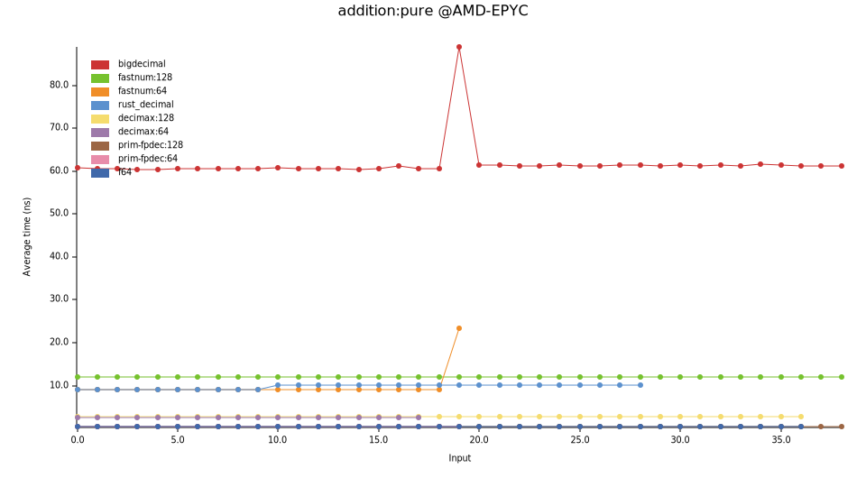
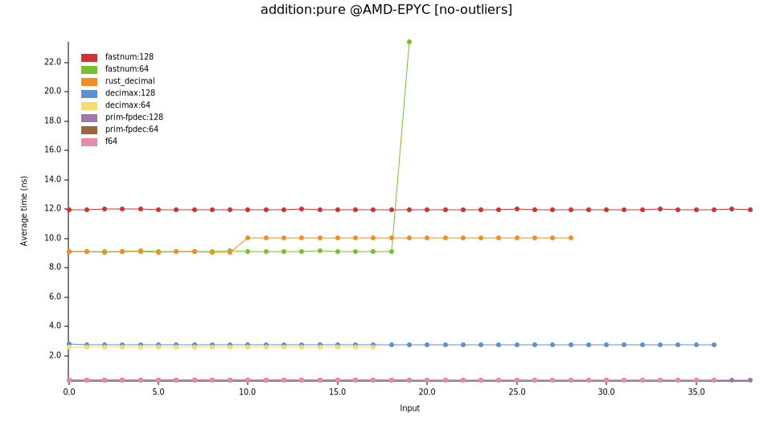

# decimal crates 对比和压测

## 简介

众所周知，由于2和10的质因子不相同，二进制小数无法准确表示十进制小数。比如使用二进制浮点类型 `f32`，会有经典的算术误差：0.1+0.2!=0.3。

有的应用场景，比如金融，需要精确表示十进制小数。这就需要十进制库 decimal crate。Rust生态中有很多decimal crate，设计不同，各有侧重。本文选取几个crate做对比和测试。

在对比分析他们的区别之前，先简单说下他们的相同之处。这些decimal crate的基本原理是一样的，都是使用整数来表示有效数字，再用一个scale来表示十进制的小数位数。比如，值1.23，可以用整数123和scale=2来表示。这些crate的区别之处在于两点：1. scale是固定的还是变化的；2. 整数用一个还是多个。从这两个角度，可以把这些decimal crate划分为几种类型。


## 定点和浮点

*[Fixed-point](https://en.wikipedia.org/wiki/Fixed-point_arithmetic)* vs *[Floating-point](https://en.wikipedia.org/wiki/Floating-point_arithmetic)*。

定点的scale是固定的，不会变化的，跟数据类型type绑定的。而浮点的scale是浮动的，会随着计算而变化的，是存储在每个实例中的。

用代码说话，一个典型的 *定点数* 的定义可能是这样的：

```rust
struct FixedPoint<const SCALE: i32>(i128); // scale is bound to type
```

而一个典型的 *浮点数* 的定义可能是这样的：

```rust
struct FloatingPoint {
    mantissa: i128,
    scale: i32, // scale is stored in each instance
}
```

这就可以清楚的看到，定点数的小数精度是固定的，而浮点数的小数精度不固定。比如上述 `FixedPoint<2>` 的小数精度就是2。而 `FloatingPoint` 的小数精度，取决于每个实例的scale。由于这个区别，定点数和浮点数所表现出来的差异如下：

1. 定点数表示的范围较小，而浮点数表示的范围较大。可以参考二进制浮点数f32的范围是非常大的。这是由于当数值很大时，小数精度会变的很低。

2. 定点数更简单更快，而浮点数复杂且慢。比如加法 `+` 和减法 `-` 运算，定点数只需要把表示mantissa的整数相加或相减，而浮点数需要先判断两个操作数的scale是否一致（这个判断本身就比加减本身要慢），如果不一致还需要通过乘法做对齐。下面的压测章节里会做详细介绍。

3. 定点数的使用稍微繁琐，而浮点数更方便。比如上面的 `FixedPoint`，需要在编译时就确定每个类型的scale，比如 `Balance` 几位小数，`Price` 几位小数。而浮点数则无需考虑。这里类似静态类型语言和动态类型语言的区别。

大部分的应用使用decimal crate只是为了能精确表示十进制小数，而对性能或小数精度并没有很高的要求，那为了使用方便，优先选择浮点数。但如果是更严肃的服务，比如很多金融应用，要求确定的小数精度，或者高性能，那么就建议选择定点数。比如希望USD的资产的小数精度就是2，不能多也不能少。

NOTE：由于大部分编程语言中自带的浮点类型（比如C的`float`和`double`，Rust的 `f32`和`f64`）的原因，很多人以为浮点数就是这些类型，浮点数无法精确表示十进制小数。这个观点是错误的。这些类型是“二进制”浮点数，Binary Floating-point。他们不能精确表示十进制小数的原因是”二进制 Binary”而非“浮点 Floating-point"。只不过因为他们常被叫成"浮点数 Floating-point”而省略了“二进制 Binary”，所以“floating-point”就背了这个锅。其实，即便是“二进制定点数” Binary Fixed-point，比如 [`fixed`](https://docs.rs/fixed/latest/fixed/) crate，也是不能精确表示十进制小数的。

NOTE：浮点数是有标准的，[IEEE 754](https://en.wikipedia.org/wiki/IEEE_754)，其中定义了二进制浮点数（也就是f32/f64遵循的标准）和十进制浮点数。但是要注意这个标准IEEE 754只是浮点数的一种实现方式，并不等于浮点数。浮点数也可以选择其他的实现方式。比如其定义的十进制格式就并不太适合。所以大部分decimal crate都不遵循这个标准。

## 固定精度和任意精度

*[Fixed-precision](https://en.wikipedia.org/wiki/Fixed-precision_arithmetic)* vs
*[Arbitrary-precision](https://en.wikipedia.org/wiki/Arbitrary-precision_arithmetic)*。

首先明确下这里“精度 precision”这个词的含义。这个词有两个冲突的含义：小数数字的位数 和 有效数字的位数。比如对于值1.23，其小数数字有2位，有效数字是3位。在 [std::fmt](https://doc.rust-lang.org/std/fmt/index.html#precision) 中使用的是前者含义；而在这里使用的是后者含义。这个是[标准的叫法](https://en.wikipedia.org/wiki/Fixed-precision_arithmetic)。但是却很容易引起歧义，比如 Fixed-precision 经常被误认为是小数精度，跟 Fixed-point 混淆。为了避免歧义，我们改用 Fixed-size 来代替 Fixed-precision。

顾名思义，Fixed-size 是使用固定个数的integer（一个或多个）。而 Arbitrary-precision 根据需求使用任意个数的integer，一方面可以向左边扩展，避免溢出；另一方面可以向右边扩展，避免精度丢失。显然这就需要从堆上分配内存，所以类型不是 `Copy` 的，crate也不是 `no-alloc` 的。而且所有的运算也会很慢。如果不是有明确的需求，一般优先选择 Fixed-size。

## crate的选择

我们选择几个decimal crate做对比和压测。

- bigdecimal
- fastnum
- rust_decimal
- decimax
- primitive_fixed_point_decimal

### crate: bigdecimal

Floating-point | Arbitrary-precision

唯一一个活跃的 Arbitrary-precision 的crate。内部使用u64或u32的Vector来表示mantissa。内存布局如下：

```
+-u64----+--------+--------+--------+--------+
| sign   | Vec<u64>                 | scale  |
+--------+--+-----+--------+--------+--------+
            |
            +--------+--------+----
            | u64    |  …     |
            +--------+--------+----
```

Meta信息就需要占用5个word，共40字节，内存是比较松散的。由于在创建和按需扩展时需要内存分配，读写时需要指针跳转，所以性能也是比较差的（在下面的benchmark中可以明显看到）。

所以这个crate就是追求 Arbitrary-precision 而放弃了内存和性能。

## crate: fastnum

Floating-point | Fixed-size

其Decimal定义如下：`struct Decimal<const N: usize>`，其中N是表示mantissa的u64的个数。比如 `Decimal<2>`就是2个u64，共128bit的mantissa。所以他的文档里也说自己是 [Arbitrary-precision](https://crates.io/crates/fastnum/0.7.4)。区别是，bigdecimal是在运行时调整，而这个fastnum是在编译期指定。

Decimal的内存布局如下：

```
+-u64----+--------+...+--------+
| [u64; N]            | CBlock |
+--------+--------+...+--------+
```

其中的 `CBlock` 是 `fastnum` 用来存储meta信息的 `ControlBlock`，除了基本的sign和scale外，还有其他字段，参考其[文档](https://docs.rs/fastnum/0.7.4/fastnum/#memory-layout)查看详细信息。

另外，`fastnum` 还提供了很多 f32/f64 提供的科学运算的方法，比如`sin`/`cos`, `sqrt`, `log`等。这也是其他decimal crate都没有提供的功能。不过我个人认为这些功能并不合理。人们使用decimal就是为了能精准表示十进制小数。而这些科学计算的结果通常是无理数，是无法被精确表示的。所以需要这些运算的场景（即便是金融领域，比如一些价格预测需要用到复杂的公式）是不适合decimal的，而应该用快的多的binary（即f32/ f64）。

文档中宣称 [blazing fast](https://docs.rs/fastnum/0.7.4/fastnum/#why-fastnum)，但其给的压测对比数据，是跟本来就很慢的 `bigdecimal` 相比。在本文下面的压测中，跟其他选中的crate相比，他的速度是最慢的。不过他可能自认为也是 Arbitrary-precision，所以他对标的就是 `bigdecimal`。

另外，他的文档真的很详细。

### crate: rust_decimal

Floating-point | Fixed-size

最流行的decimal crate。从下载量、被依赖的crate数量、对接生态（比如serde, postgres等）的丰富程度来看，都是最流行的。也是最古老的decimal crate之一，第一个版本发布在2016年底。古老，也可能是流行的很大原因。

只支持128-bit的有符号decimal。内存布局：

```
+-u32--+------+------+------+
| flag | high | mid  | low  |
+------+------+------+------+
```

mantissa由3个u32组成，共96bit，大概是28位十进制。在运算时，需要依次处理3个u32，导致其速度不是很快。元信息 flag 中是1bit的sign和5bit的scale，scale的范围是 [0-28]，flag中的其他bit保留。

其文档中说，采用这个内存布局，是为了[性能优化](https://docs.rs/rust_decimal/1.41.0/rust_decimal/#comparison-to-other-decimal-implementations)。但在本文下面的压测对比中，`rust_decimal` 的性能并不是最好的。当初这个内存，可能是因为当时Rust还不支持 `u128`，所以只能如此。

### crate: decimax

Floating-point | Fixed-size

跟 `rust_decimal` 一样的定位。优点是：1.更快，参见下面的压测结果；2.更多类型，128/64/32-bit，有符号和无符号；3.更紧凑的内存，更多有效数字。

缺点是：很新的crate，还没有 `rust_decimal` 那么多的生态接入。

一个被选择的原因是，我是他的作者。

其使用单个integer来表示，以128-bit有符号类型为例，其内存布局如下：

```
+-u128-----------------------+
|S|scale| mantissa           |
+----------------------------+
```

符号（S)和scale分别占用1bit和5bit，所以mantissa可以有122bit，大概36位十进制有效数字，比 `rust_decimal` 的28位更大。运算也是用1个u128，而不是3个u32，更快。

### primitive_fixed_point_decimal

Fixed-point | Fixed-size

本文选择的唯一一个 Fixed-point 的crate。跟上述几个crate的最大区别也就是 Fixed-point了，具体在上面[定点和浮点](#定点和浮点)小节中讲过了。

跟其他 Fixed-point decimal crate相比，这个crate最大的特点是，除了上面典型的 `FixedPoint` 类型定义外（使用常量泛型const generics，在编译期固定小数位数），还提供 `Out-of-band scale` 的方式，在运行时指定类型的scale，提供更大的灵活性。比如在一个涉及多币种的资金管理系统中，假如使用上面典型的 `FixedPoint` 类型，定义 `type Balance = FixedPoint<2>`，所有币种的小数精度都是2位。但使用这个crate的 `Out-of-band scale`类型，就可以给每个币种定义各自的小数精度。详情参见[Out-of-band 文档](https://docs.rs/primitive_fixed_point_decimal/latest/primitive_fixed_point_decimal/#specify-scale)。

由于scale是跟数据类型绑定的（无论是使用常量泛型const generics，还是使用Out-of-band），就无需在实例中存储scale，所以实例就只是mantissa。以128-bit有符号类型为例，其内存布局如下：

```
+-i128-----------------------+
| mantissa                   |
+----------------------------+
```

## 压测对比

现在来到本文的重头戏，压测对比结果。我们使用 [criterion](https://crates.io/crates/criterion)压测。项目源码在 [GitHub](https://github.com/WuBingzheng/decimal-crates-comparison)。

我们选择了加法，乘法，和除法。减法和加法的实现方式是一样的，所以不再重复测试。

除了上述的几个crate外，还选择了Rust原生的 `f64`和`f128`，作为对比。因为`f128`，所以需要使用 nightly 版本执行。


### 压测说明

压测使用的Rust及各crate版本：

- Rust: cargo 1.93.0 (083ac5135 2025-12-15)
- criterion: 0.7
- bigdecimal：0.4.10
- fastnum：0.7.4
- rust_decimal: 1.40.0
- decimax: 0.2.0
- primitive_fixed_point_decimal：1.4.2

操作系统和CPU：

- Ubuntu 22.04 @AMD EPYC 9754
- Ubuntu 16.04 @Intel Xeon, 2500 MHZ
- MacOS 13.5 @Apple M1

压测结果在不同环境里有很大的差异。如果你对结果感兴趣，建议在自己的环境里跑一遍压测：

```bash
git clone https://github.com/WuBingzheng/decimal-crates-comparison.git
cd decimal-crates-comparison
cargo +nightly bench  # +nightly because of `f128`
open target/criterion/report/index.html
```

这里 `cargo bench` 的问题在于，最终生成的chart的颜色对比不清晰。可以换成 `cargo criterion`：

```bash
cargo +nightly criterion  # +nightly because of `f128`
open target/criterion/reports/index.html
```

全套压测执行下来需要5个小时左右。可以通过制定具体的测试用例来减少时间，也可以通过 `SAMPLE` 环境变量来减少压测用例：

```bash
# run only 1/10 cases, on "addition:rescale/decimax", less than 1 minute
SAMPLE=10 cargo +nightly criterion addition:rescale/decimax
```

### Case：相等scale的加法

加法运算的流程如下：首先判断两个操作数的scale是否相等；如果相等则直接相加mantissa；如果不等，则需要首先对齐scale，然后再相加。

这节先看scale相等的情况。下节再看scale不等的情况。

图表如下：



不出所料，`bigdecimal` 高高在上。其他crate都被压缩在底层，无法看清。所以我们这里暂时删掉 `bigdecimal`，只看其他crate的结果：



这样就清晰多了。


###

对齐scale有两种情况：首先尝试调整具有较小scale的操作数，把其mantissa乘以10的某个幂；如果这个
